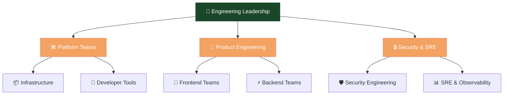

# 🏢 PES — Engineering & Operations Handbook

**Last Updated:** YYYY-MM-DD  
**Owner:** [Name / Team / Role]  

### 🚀 *Engineering Excellence Through Standardization*

---

## 📋 **Table of Contents**

---

## 🎯 **Mission & Vision**

<table>
<tr>
<td align="center" width="50%">

### 🚀 **Mission**
*What we exist to deliver*

**Engineering Excellence • Reliability • Innovation • Collaboration**

</td>
<td align="center" width="50%">

### 🌟 **Vision**  
*Where we're heading*

**Industry-leading engineering practices that drive business success**

</td>
</tr>
</table>

### 💎 **Core Principles & Values**

---

## 📖 **High-Level Overview**

This handbook serves as the single source of truth for all Engineering, Operations, Product, QA, and related teams. It documents how we operate across the organization: processes, standards, tooling, team coordination, and decision-making frameworks.

**Team-specific documentation should link back to this central handbook.**

---

## 🏗️ **Organization Structure**

<table>
<tr>
<td width="50%">

### 👥 **Team Structure**
- **Org chart** [📎 View Chart](org-chart.html)
- **Departments & Teams** with domain ownership
- **Reporting lines** and cross-team interfaces
- **Key shared services** (Platform/Infra/Security/Data/QA)

</td>
<td width="50%">

### 🔗 **Team Dependencies**
- **Internal service dependencies**
- **Cross-team collaboration frameworks**
- **Escalation paths and ownership**
- **Service level expectations**

</td>
</tr>
</table>

---

## ⚖️ **Governance & Decision Making**

<table>
<tr>
<td width="50%">

### 🎯 **Decision Framework**
- **Decision authority matrix** by role/level
- **Proposal/RFC/design-doc process**
- **Architecture review requirements**
- **Security review workflows**

</td>
<td width="50%">

### 🔄 **Process Excellence**
- **Conflict resolution procedures**
- **Escalation paths and timelines**
- **Approval workflows documentation**
- **Stakeholder engagement framework**

</td>
</tr>
</table>

---

## 📐 **Standards & Conventions**

<table>
<tr>
<td width="33%">

### 💻 **Development Standards**
- **Coding & style guides** by language
- **Repository structure & naming**
- **Branching & Git workflows**
- **Versioning policies**

</td>
<td width="33%">

### 🔧 **Operational Standards**
- **Logging & instrumentation**
- **Environment naming conventions**
- **Deployment tagging standards**
- **Dependency management**

</td>
<td width="33%">

### 📈 **Quality Standards**
- **Backward compatibility policies**
- **Deprecation procedures**
- **Performance benchmarks**
- **Security baselines**

</td>
</tr>
</table>

---

## 🛠️ **Tech Stack & Tools**

<table>
<tr>
<td width="50%">

### 🎯 **Core Technologies**
- **Primary languages & frameworks**
- **Internal libraries & guidelines**
- **Infrastructure tools** (cloud, IaC, containers)
- **Dev toolchain** (IDEs, local environments)

</td>
<td width="50%">

### 🔄 **Platform Ecosystem**
- **CI/CD pipeline & build systems**
- **Monitoring & observability stack**
- **Secrets management & security**
- **Environment specifications**

</td>
</tr>
</table>

---

## 🎓 **Onboarding & Getting Started**

### 🚀 **30-60-90 Day Journey**

<table>
<tr>
<td align="center" width="33%">

### 📅 **First 30 Days**

**Focus:** Foundation & Setup

</td>
<td align="center" width="33%">

### 🎯 **First 60 Days**

**Focus:** Contribution & Integration

</td>
<td align="center" width="33%">

### 🏆 **First 90 Days**

**Focus:** Mastery & Growth

</td>
</tr>
</table>

---

## 🔄 **Processes & Workflows**

<table>
<tr>
<td width="50%">

### 🎯 **Core Processes**
- **Feature development lifecycle**
- **Release & deployment pipeline**
- **Hotfix & rollback procedures**
- **Testing strategy & frameworks**

</td>
<td width="50%">

### 🛡️ **Operational Excellence**
- **Incident management & postmortems**
- **Change management & approvals**
- **Service ownership & on-call**
- **SLA/SLO definitions & tracking**

</td>
</tr>
</table>

---

## 📚 **Documentation & Knowledge Base**

<table>
<tr>
<td width="50%">

### 🏗️ **Documentation Framework**
- **Documentation locations & tools**
- **Style guides & standards**
- **Structure & taxonomy**
- **Ownership & review cycles**

</td>
<td width="50%">

### 🔄 **Knowledge Management**
- **Update & retirement procedures**
- **Search & discovery systems**
- **Training materials**
- **Best practices library**

</td>
</tr>
</table>

---

## 🔒 **Security, Compliance & Access**

<table>
<tr>
<td width="50%">

### 🛡️ **Security Framework**
- **Security policies & principles**
- **Access control & permissions**
- **Secrets management & rotation**
- **Vulnerability management**

</td>
<td width="50%">

### 📋 **Compliance & Governance**
- **Data privacy & compliance**
- **Audit & reporting requirements**
- **Incident response planning**
- **Risk management framework**

</td>
</tr>
</table>

---

## 💬 **Communication & Meeting Norms**

<table>
<tr>
<td width="50%">

### 📢 **Communication Framework**
- **Channel usage guidelines**
- **Etiquette & best practices**
- **Decision documentation**
- **Meeting note standards**

</td>
<td width="50%">

### 🎯 **Meeting Excellence**
- **Standup & planning cadence**
- **Retrospective formats**
- **Timeboxing & agenda norms**
- **Stakeholder communication**

</td>
</tr>
</table>

---

## 🤝 **Contribution & Change Management**

<table>
<tr>
<td width="50%">

### 🔄 **Change Management**
- **Handbook change process (RFC/PR)**
- **Ownership & approval model**
- **Versioning & deprecation policies**
- **Rollout planning framework**

</td>
<td width="50%">

### 📈 **Continuous Improvement**
- **Feedback mechanisms**
- **Policy retrospective process**
- **Improvement tracking**
- **Success measurement**

</td>
</tr>
</table>

---

## 👥 **Contacts & Roles**

| 👤 **Role / Title** | 🎯 **Responsibilities / Domain** | 📞 **Contact Info** |
|:---|:---|:---|
| **CTO / Head of Engineering** | Vision, architecture, major decisions | `@cto` |
| **Platform Lead** | Shared services, infrastructure | `@platform-lead` |
| **Security Lead** | Security, audits, compliance | `@security` |
| **SRE Lead** | On-call, monitoring, reliability | `@sre` |
| **Engineering Manager** | Team leadership, delivery | `@eng-manager` |

---

## 📖 **Glossary & Definitions**

<table>
<tr>
<td width="50%">

### 🔤 **Core Terminology**
- **SLO**: Service Level Objective
- **CD**: Continuous Deployment
- **Trunk-based Development**
- **Feature Flagging**

</td>
<td width="50%">

### 📚 **Process Terms**
- **RFC**: Request for Comments
- **SLA**: Service Level Agreement
- **MTTR**: Mean Time to Recovery
- **CI/CD**: Continuous Integration/Deployment**

</td>
</tr>
</table>

---

## 📝 **Changelog**

| 📅 **Date** | 👤 **Author** | 📋 **Change Summary** |
|:---|:---|:---|
| YYYY-MM-DD | [Name] | Added incident management section |
| YYYY-MM-DD | [Name] | Updated tech stack documentation |
| YYYY-MM-DD | [Name] | Revised onboarding process |

---

## 🎯 **Engineering Excellence in Action**

> ### *"Standardization enables innovation. Consistency fuels velocity. Clarity drives excellence."*

---

### 🔗 **Quick Navigation**

---

**Last Updated:** YYYY-MM-DD • **Version:** 2.0  
**Made with ❤️ by the Engineering Excellence Team**

