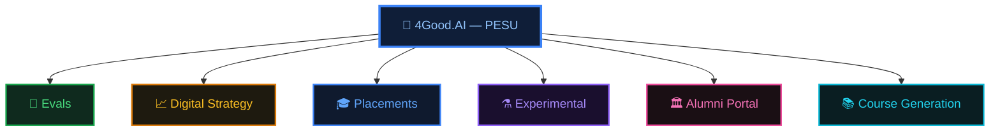

# PESU Project Plan

*"We build technology for good — purposeful products, principled engineering, people-first culture."*

🏢 **Owner: Engineering Excellence Team** &nbsp;|&nbsp; 📍 **4Good.AI Organisation** &nbsp;|&nbsp; 🔄 **Living Document**

---

## 🤝 Code of Conduct

We expect everyone in this organisation — contributors, reviewers, leads — to act with respect and professionalism.

📄 Full Code of Conduct: [CODE_OF_CONDUCT.md](CODE_OF_CONDUCT.md)

- Be kind and constructive in reviews and discussions
- Assume good intent
- Raise concerns through the right channels
- Zero tolerance for harassment or exclusion

---

## 🍳 4Good Dev Cookbook

Your practical guide to getting things done here. 📖 Full Cookbook: [Wiki → Dev Cookbook](https://your-cookbook-link)

- Setting up your local development environment
- Running services locally and with Docker
- Common debugging patterns
- How to use our internal tooling and libraries
- Environment variables and secrets management
- How to write and run tests

---

## 🎯 Mission & Vision

**Mission:** Build AI-powered products that are ethical, accessible, and genuinely useful for people and organisations.

**Vision:** To be a trusted engineering organisation where great ideas become great products — with discipline, speed, and integrity.

| Value | Description |
|---|---|
| 🤝 Shared Ownership | Everyone is responsible for quality |
| 🛡️ Reliability First | We ship things that work |
| 🔄 Continuous Improvement | We get better every sprint |
| 🌟 Collaborative Excellence | We build together, not in silos |

---

## 🌿 PESU Products

Click on any product to open its document.

```mermaid
flowchart TD
    ROOT["🏢 4Good.AI — PESU"]

    ROOT --> E["🧪 Evals"]
    ROOT --> DS["📈 Digital Strategy"]
    ROOT --> PL["🎓 Placements"]
    ROOT --> EX["⚗️ Experimental"]
    ROOT --> AP["🏛️ Alumni Portal"]
    ROOT --> CG["📚 Course Generation"]

    click E "https://your-evals-doc-link" _blank
    click DS "https://your-digitalstrategy-doc-link" _blank
    click PL "https://your-placements-doc-link" _blank
    click EX "https://your-experimental-doc-link" _blank
    click AP "https://your-alumniportal-doc-link" _blank
    click CG "https://your-coursegeneration-doc-link" _blank

    classDef root    fill:#0f1e38,stroke:#3b82f6,stroke-width:3px,color:#93c5fd
    classDef evals   fill:#0f2a1e,stroke:#16a34a,stroke-width:2px,color:#4ade80
    classDef digital fill:#1e1a0f,stroke:#d97706,stroke-width:2px,color:#fbbf24
    classDef place   fill:#0f1a2e,stroke:#3b82f6,stroke-width:2px,color:#60a5fa
    classDef exper   fill:#1a0f2e,stroke:#8b5cf6,stroke-width:2px,color:#a78bfa
    classDef alumni  fill:#1a0f14,stroke:#ec4899,stroke-width:2px,color:#f472b6
    classDef course  fill:#0a1e22,stroke:#06b6d4,stroke-width:2px,color:#22d3ee

    class ROOT root
    class E evals
    class DS digital
    class PL place
    class EX exper
    class AP alumni
    class CG course
```

---

## ✅ Quality Management System (QMS)

Our QMS defines how we maintain and improve quality across the organisation. 📖 Full QMS: [Wiki → QMS](https://your-qms-link)

- Testing strategy (unit, integration, end-to-end)
- Release quality gates
- Incident postmortem process
- Audit and compliance requirements
- SLA/SLO definitions per product

---

## 🔗 Key Links & Resources

### 🏢 Organisation

| Resource | Link |
|---|---|
| 📖 Wiki | [Open →](https://your-wiki-link) |
| 🍳 Dev Cookbook | [Open →](https://your-cookbook-link) |
| ✅ QMS | [Open →](https://your-qms-link) |
| 📋 Project Plan | [Open →](https://your-project-plan-link) |
| ⚙️ GitHub Config | [Open →](.github/) |
| 🤝 Contributing Guide | [Open →](CONTRIBUTING.md) |
| 📜 Code of Conduct | [Open →](CODE_OF_CONDUCT.md) |

---

### 🧪 Evals

| 🌐 Demo | 📁 Repo | 📖 Docs | 🐛 Bug Tracker |
|:---:|:---:|:---:|:---:|
| [Open →](https://your-evals-demo-link) | [Open →](https://your-evals-repo-link) | [Open →](https://your-evals-docs-link) | [Open →](https://your-evals-bugs-link) |

---

### 📈 Digital Strategy

| 🌐 Demo | 📁 Repo | 📖 Docs | 🐛 Bug Tracker |
|:---:|:---:|:---:|:---:|
| [Open →](https://your-digitalstrategy-demo-link) | [Open →](https://your-digitalstrategy-repo-link) | [Open →](https://your-digitalstrategy-docs-link) | [Open →](https://your-digitalstrategy-bugs-link) |

---

### 🎓 Placements

| 🌐 Demo | 📁 Repo | 📖 Docs | 🐛 Bug Tracker |
|:---:|:---:|:---:|:---:|
| [Open →](https://your-placements-demo-link) | [Open →](https://your-placements-repo-link) | [Open →](https://your-placements-docs-link) | [Open →](https://your-placements-bugs-link) |

---

### ⚗️ Experimental

| 🌐 Demo | 📁 Repo | 📖 Docs | 🐛 Bug Tracker |
|:---:|:---:|:---:|:---:|
| [Open →](https://your-experimental-demo-link) | [Open →](https://your-experimental-repo-link) | [Open →](https://your-experimental-docs-link) | [Open →](https://your-experimental-bugs-link) |

---

### 🏛️ Alumni Portal

| 🌐 Demo | 📁 Repo | 📖 Docs | 🐛 Bug Tracker |
|:---:|:---:|:---:|:---:|
| [Open →](https://your-alumniportal-demo-link) | [Open →](https://your-alumniportal-repo-link) | [Open →](https://your-alumniportal-docs-link) | [Open →](https://your-alumniportal-bugs-link) |

---

### 📚 Course Generation

| 🌐 Demo | 📁 Repo | 📖 Docs | 🐛 Bug Tracker |
|:---:|:---:|:---:|:---:|
| [Open →](https://your-coursegeneration-demo-link) | [Open →](https://your-coursegeneration-repo-link) | [Open →](https://your-coursegeneration-docs-link) | [Open →](https://your-coursegeneration-bugs-link) |

---

*This handbook is a living document. Raise a Discussion or PR to propose changes.*

**Last Updated: 2026-03-11 &nbsp;•&nbsp; Version: 2.0 &nbsp;•&nbsp; Made with care by the PESU Engineering Team**

