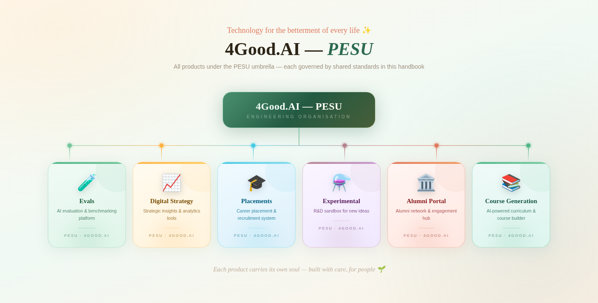

# PESU Project Plan

*"We build technology for good — purposeful products, principled engineering, people-first culture."*

🏢 **Owner: Engineering Excellence Team** &nbsp;|&nbsp; 📍 **4Good.AI Organisation** &nbsp;|&nbsp; 🔄 **Living Document**

---

## 🤝 Code of Conduct

We expect everyone in this organisation — contributors, reviewers, leads — to act with respect and professionalism.

📄 Full Code of Conduct: [CODE_OF_CONDUCT.md](CODE_OF_CONDUCT.md)

- Be kind and constructive in reviews and discussions
- Assume good intent
- Raise concerns through the right channels
- Zero tolerance for harassment or exclusion

---

## 🍳 4Good Dev Cookbook

Your practical guide to getting things done here. 📖 Full Cookbook: [Wiki → Dev Cookbook](https://your-cookbook-link)

- Setting up your local development environment
- Running services locally and with Docker
- Common debugging patterns
- How to use our internal tooling and libraries
- Environment variables and secrets management
- How to write and run tests

---

## 🎯 Mission & Vision

**Mission:** Build AI-powered products that are ethical, accessible, and genuinely useful for people and organisations.

**Vision:** To be a trusted engineering organisation where great ideas become great products — with discipline, speed, and integrity.

| Value | Description |
|---|---|
| 🤝 Shared Ownership | Everyone is responsible for quality |
| 🛡️ Reliability First | We ship things that work |
| 🔄 Continuous Improvement | We get better every sprint |
| 🌟 Collaborative Excellence | We build together, not in silos |

---

## 🌿 PESU Products

> 💡 Click a product badge in **Key Links & Resources** below to jump straight to its docs, demo, or repo.

---

## ✅ Quality Management System (QMS)

Our QMS defines how we maintain and improve quality across the organisation. 📖 Full QMS: [Wiki → QMS](https://your-qms-link)

- Testing strategy (unit, integration, end-to-end)
- Release quality gates
- Incident postmortem process
- Audit and compliance requirements
- SLA/SLO definitions per product

---

## 🔗 Key Links & Resources

### 🏢 Organisation

---

### 🧪 Evals
> AI Evaluation & Benchmarking Platform

---

### 📈 Digital Strategy
> Strategic Insights & Analytics Tools

---

### 🎓 Placements
> Career Placement & Recruitment System

---

### ⚗️ Experimental
> R&D Sandbox for New Ideas

---

### 🏛️ Alumni Portal
> Alumni Network & Engagement Hub

---

### 📚 Course Generation
> AI-Powered Curriculum & Course Builder

---

*This handbook is a living document. Raise a Discussion or PR to propose changes.*

**Last Updated: 2026-03-11 &nbsp;•&nbsp; Version: 2.0 &nbsp;•&nbsp; Made with care by the PESU Engineering Team**

